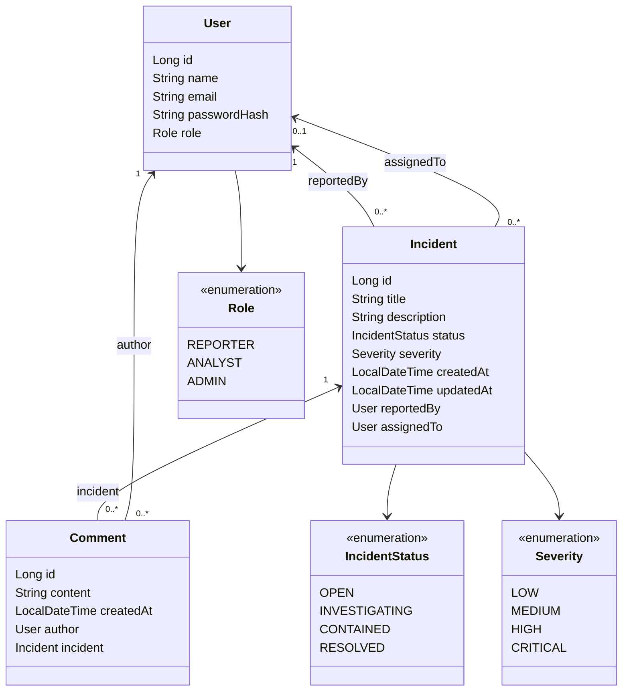

# Cyber Incident Tracker – foreslået datamodel

Dette diagram viser de entities, jeg foreslår til projektets første version.
`Incident`, `User`, `Role`, `IncidentStatus`, `Severity` og relationen
`reportedBy` findes i koden. Kommentarer, tidsstempler, `assignedTo` og
`passwordHash` er planlagte udvidelser.

## Formål

Systemet skal lade brugere rapportere sikkerhedshændelser, tildele en ansvarlig
analytiker og følge arbejdet gennem status og kommentarer.

## Klassediagram over entities

Diagrammet viser data og relationer. Getters, setters og konstruktører er
udeladt. Enums er faste værdisæt, ikke selvstændige entities.

## De tre entities

| Entity | Ansvar | Eksempel |
|---|---|---|
| Incident | Gemmer selve hændelsen, dens status og alvorlighed | En medarbejder har modtaget en phishingmail |
| User | Repræsenterer rapportører, analytikere og administratorer | En analytiker får ansvaret for hændelsen |
| Comment | Gemmer en besked om arbejdet med én hændelse | "Afsenderen er blokeret, og mailen er fjernet" |

## Roller og planlagte rettigheder

Alle personer er `User`-objekter med én `Role`. Vi bruger ikke separate
klasser for rapportører, analytikere og administratorer. Nye brugere får
automatisk `REPORTER`, og rollen gemmes som tekst i databasen.

| Rolle | Ansvar | Planlagte rettigheder |
|---|---|---|
| REPORTER | Indberetter hændelser | Oprette incidents og se sine egne |
| ANALYST | Undersøger og håndterer hændelser | Se alle incidents og ændre status og alvorlighedsgrad |
| ADMIN | Administrerer systemet | Analytikerens rettigheder samt administration af brugere og roller |

Rollefeltet er implementeret som data. Rettighederne i tabellen er et
designforslag og håndhæves endnu ikke. Login og adgangskontrol tilføjes
senere, så serveren kontrollerer den indloggede brugers rolle og ejerskab.
Brugere skal ikke selv kunne tildele sig administratorrollen.

## Relationer og regler

- Hver hændelse har én rapportør (`reportedBy`). En bruger kan rapportere nul eller mange hændelser.
- En hændelse har nul eller én ansvarlig (`assignedTo`). Den kan altså oprettes, før arbejdet bliver fordelt.
- En bruger kan være ansvarlig for nul eller mange hændelser. Service-laget skal kontrollere, at den ansvarlige har en passende rolle.
- Hver kommentar tilhører én hændelse og har én forfatter. En hændelse og en bruger kan hver have nul eller mange kommentarer.
- En ny hændelse starter som `OPEN` og har som udgangspunkt severity `MEDIUM`.
- Titel og kommentarindhold må ikke være tomme. Brugerens e-mail skal være unik.
- `passwordHash` gemmer en hash af adgangskoden og må ikke returneres fra API'et. Login implementeres i et senere trin.
- Første version har én rolle pr. bruger. Flere roller pr. bruger er en mulig senere udvidelse.
